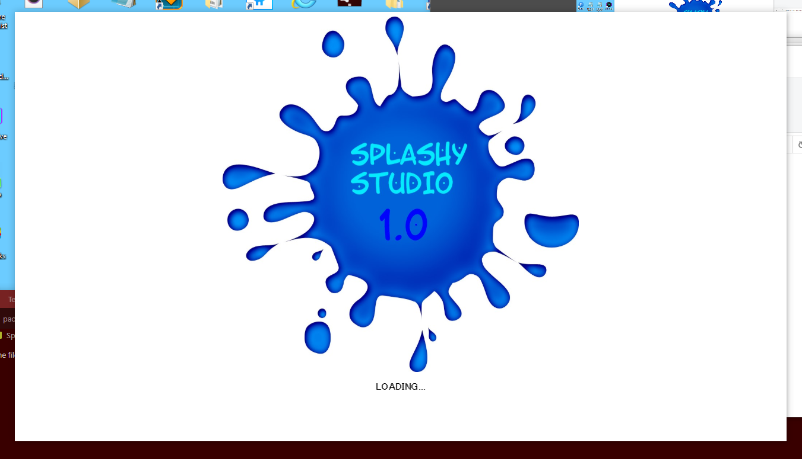
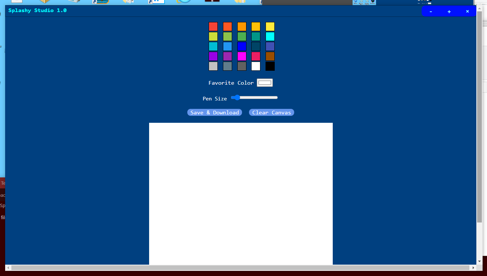

# Splashy Studio 1.0
<b>Splashy Studio 1.0</b> is a really cool program in which you can only use pen drawing, which is only fair because it&apos;s just the initial release so <b>DON&apos;T COMPLAIN, YOU CAN&apos;T!</b>
# Overview
  
#
<li>Made with <a href="https://www.electronjs.org" title="Go to electronjs.org"><b>ELECTRON</b></a></li>
<h1>JSYK (Just So You Know)</h1>
I didn&apos;t add the &quot;<b>node_modules</b>&quot; folders and all that because I knew I would have dealt with so many problems if I did, just <b>ENJOY</b> knowing the source code. &#128150; ya, BYEEE!
